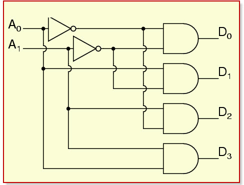
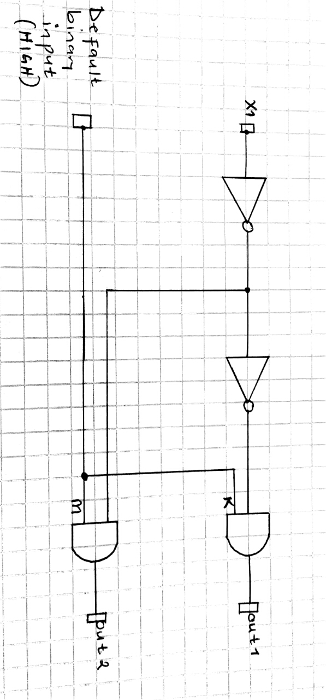
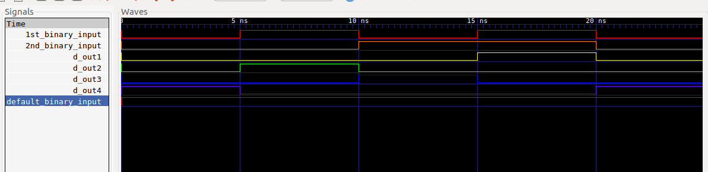

A 2 to 4 line decoder is a 4 output logic circuit that takes 2 inputs. At any point in time, according to the combination of the input signals, there can only be 1 output signal that is HIGH. 

This is reimplementation of the 2 to 4 line decoder with 2 more submodules. The level of abstraction has dropped further to model the the behaviour of the 1 to 2 line decoder with the circuit shown below:
Therefore 2 new classes anding_gate and inverter are introduced to model the above functionality.
 
### Circuit:

  

The truth table  is as shown below:

  

The MOC of the reimplemented 1 t0 2 line decoder module is as shown below

### Model of computation:

  

### Results:
The above MOC was implemented in systemc (code in this folder) and the following output found from traced signals. 
Traced signals timing diagram:

  

