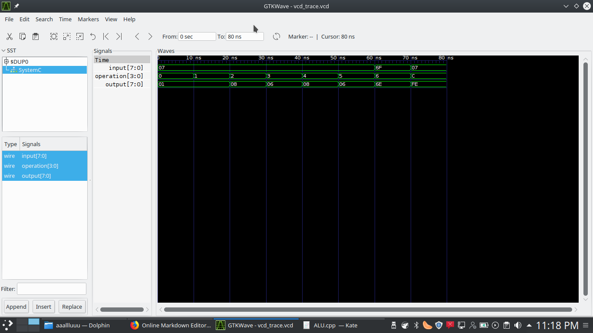
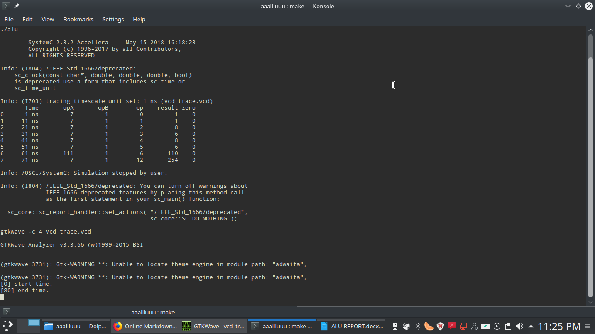

 
### Arithmetic Logic Unit

The Arithmetic Logic Unit (ALU) is found within the computer’s Central Processing Unit (CPU). During its operation, it takes data from the memory registers within a CPU and works on the said data using a clearly defined set of operations. The data that is worked on are called Operands. The important thing to note about the ALU is that it determines the size of data that a processor can handle. We can therefore infer that a 32-bit processor has, as one of its modules, a 32-bit ALU (Thakur, 2018). 

## Definitions
The ALU does the arithmetic and the logical operations of the computer. It Is possible for a processor to have more than one of these components and some processors do. In this kind of configuration, one may be used for fixed point and another may be used for floating point operations for example. Some of the terms that are used frequently in the context of the ALU include but are not limited to:
1. Bus: These are the channels through which data moves from the registers to the ALU.
2. Registers: Store the data that ALU operates on as well as the outputs.
3. Op code: The code that tells the ALU what operation it needs to do.
4. Accumulator: Stores the Accumulated results of the ALU.
An efficient and fast ALU results in a faster processor. This fact has led to the increased research into developing faster processors (Brown & Kruger, 2018). 

## Working principle
The image below shows the overview of the ALU that was to be created. The ALU has two inputs that are named Operand1 and Operand2.  These two inputs will be processed based on the instructions from the opcode. Following the running of the operation, the result (which is the output) is produced. The ALU to be constructed is to perform the following functions: 
i. ADD
ii. SUBTRACT
iii. INCREMENT
iv. DECREMENT
v. Bit-wise AND
vi. Bit-wise OR
vii. Bit-wise NAND
viii. Bit-wise XOR

## Implementation in Systemc
We implemented an abstract and top-level design of an ALU. What we modelled was the functionality of the module and the outputs that we expect to get from the same based on the inputs that have been given. The following shows a breakdown of what the project entailed. 
The driver.h file contains the implementation of the code that takes as input to the ALU the values for the operands in binary. In this case, we have the inputs renamed to opA and opB for ease of coding. The inputs themselves have been given binary values that correspond to decimal numbers. The numbers given are 0b111 corresponding to the decimal number 7 and 0b001 corresponding to the decimal number 1. The two values were chosen arbitrarily for the said function.
The ALU.h file contains the implementation for switching the opcode. The opcode here was the function to be carried out and the flow control was done using the Switch-Case method. All the 8 functions that were required of the ALU were simulated and outputs gotten were as expected. 

### GTKwave trace data

  

### Termnal Output data

  

