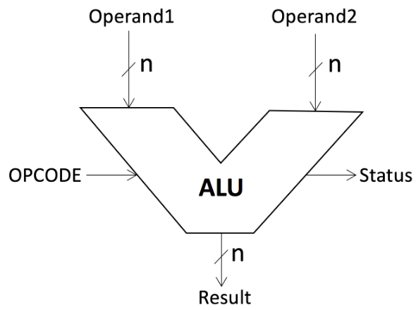
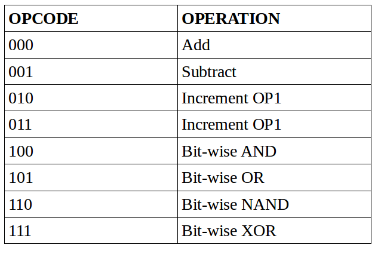
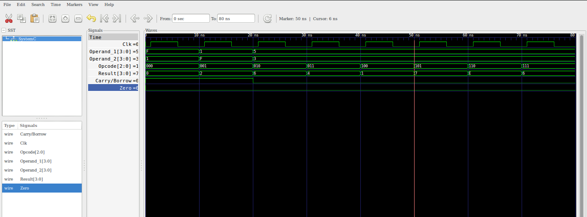

### CONTRIBUTORS
1.I39/2486/2016 - Stephen Odhiambo - Research 
2.I39/1383/2015 - Ruth Mbugua - Research 
3.I39/2485/2016 - Hudson Lundi - Coding 
4.I39/2495/2016 - Evans Shango - Testing and Debugging  
5.I39/2499/2016 - Bliss Maake - Report  

This is an ALU, which is a makefile project and so no need for an IDE. 
Just cd into the folder and run the command 'make'.  

### ALU(ARITHMETIC AND LOGIC UNIT)

An Arithmetic Logic Unit (ALU) is a combinational logic circuit that can perform different arithmetic and bitwise logical operations on integer binary numbers. 
It takes two inputs, called operands, and a code, called OPCODE, which specifies the operation to be performed on the operands.It also has the result/output which is the result of the operation on the operands. 
ALU may have Status signals on the output, which carry supplemental information about the results of the operation.e.g it can be a carry-out/borrow bit, zero bit, negative, and parity. 
Operands and results generated are normally read or stored in registers. 

ALU can be depicted as shown:

  

Operand1 and Operand2 are the inputs.

### OPERATIONS

ALUs perform the following operations:- 
Logical Operations that include AND, OR, NOT, XOR, NOR, NAND  
Arithmetic Operations:Bit addition and subtraction. 
Bit-Shifting Operations: This pertains to shifting the positions of the bits by a certain number of places to the right or left. 
This operations are defined by OPCODES and the OPCODES are then called as functions to manipulate the inputs and produce result  

The ALU modelled took two 4-bit numbers as inputs output results as:-  

• Sum of the two numbers. 
• Difference of the two numbers. 
• Increment of the first operand (OP1) by 1. 
• Decrement of the first operand (OP1) by 1. 
• Bit-wise AND of the two numbers. 
• Bit-wise OR of the two numbers. 
• Bit-wise NAND of the two numbers. 
• Bit-wise XOR of the two numbers  

The result output of the ALU consisted of one 4-bit result (RESULT), a carry/borrow bit (CARRY) and a zero bit (ZERO). 

The OPCODE Table of the operations are as shown:- 

  

### RESULTS

The ALU was implemented in systemc and the following output found from traced signals. 

Traced signals timing diagram:

  

### CONCLUSION
The 4-bit ALU with functionalities mentioned in the OPCODE was implemented successfully.

