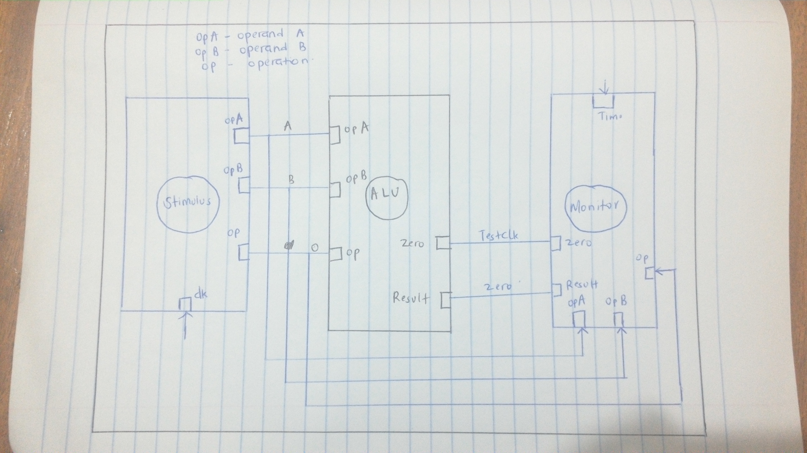

### The ALU
Contributors: 
Sarah Anyango		I39/2488/2016	Research
Kibii Immanuela		I39/5521/2014	MoC
Sarah Agatha		I39/37276/2016	Research
Josphat Njoroge		I39/1387/2012	Code

An Arithmetic Logic Unit (ALU) is a combinational logic circuit that can perform different
arithmetic and bit-wise logical operations on integer binary numbers. ALU is the fundamental
building block of many computing circuits including Central Processing Units (CPUs).
An ALU usually takes two inputs, called operands, and a code, called OPCODE, which specifies
the operation to be performed on the operands. ALU also has a result output which is the result of
the operation on the operands. In some designs, usually the values (operands) fed to the ALU and/or
the result generated from ALU are read from/stored in registers. A general symbolic representation
of an ALU is shown in below. 

### ALU

  

### Truth Table 
The truth table of a 4Bit ALU is as follows 

  

### Model of Computation
Model of Computation used to develop the ALU:

  

### Timing Diagram
The timming diagram of the ALU is as follows

  

