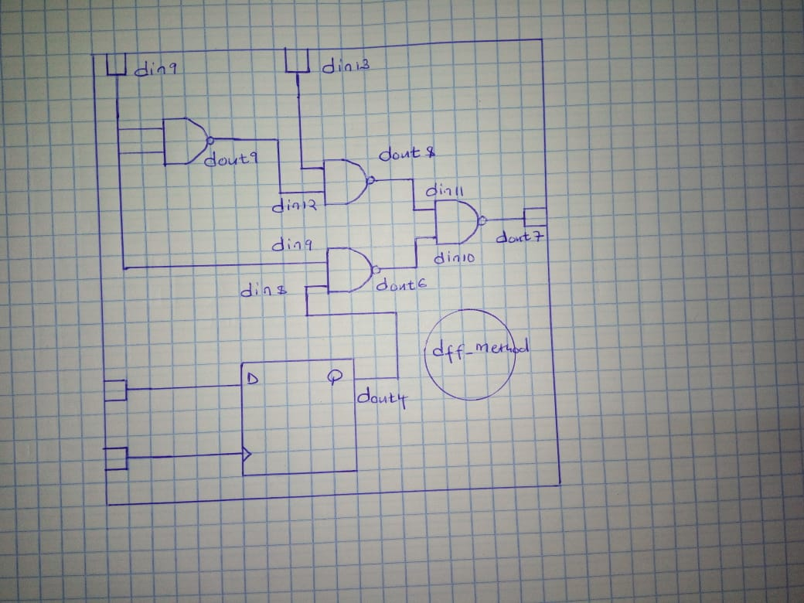
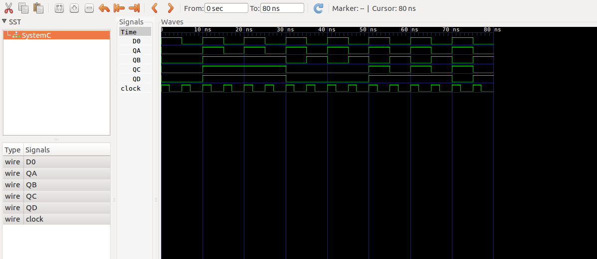

D Flip-flops are used as a part of memory storage elements and data processors as well. D flip-flop can be built using NAND gate or with NOR gate. The major applications of D flip-flop are to introduce delay in timing circuit, as a buffer, sampling data at specific intervals. Whenever the clock signal is LOW, the input is never going to affect the output state. The clock has to be high for the inputs to get active. Thus, D flip-flop is a controlled Bi-stable latch where the clock signal is the control signal. 

In this lab we are using NAND gates for demonstrating the D flip flop. As a result of adding the details to the previous implementation, these files, main.cpp, dff.h and dff.cc have been edited to add more input and output ports. More signals have been added in the main.cpp file to map the output ports to the input ports.

### The symbol of a DFF
The symbol of a D-flipflop is as shown below

  

### The circuit for the DFF
The circuit implementation of the D-flipflop is as shown below

  

### The MOC 
The MOC of the lab is as shown below

  

### The Truth table
The truth table of the circuit above is as shown below

  

### The result 
The result of this lab is shown in image below

  

### conclusion
Conclusion:
The objective of this lab, to model a d-flipflop with more deatils was met.

