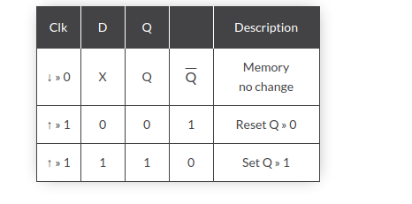
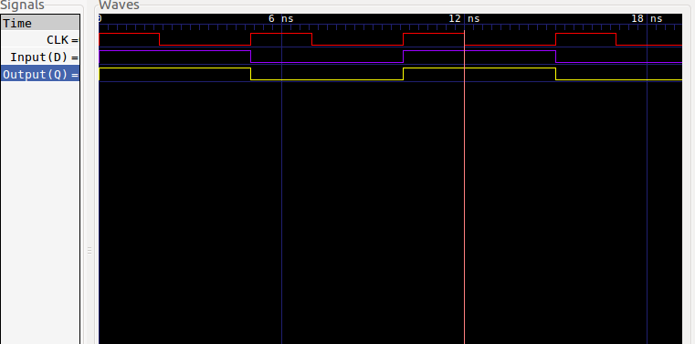

### The D Flip-flop
The D-type flip-flop is a modified Set-Reset flip-flop with the addition of an inverter to prevent the S and R inputs from being at the same logic level.
A flip-flop is a device that has two stable states and is used to store state information.
The D flip-flop captures input D and sends it to output Q at the positive or negative edge of the clock.
The D flip-flop modelled in here is triggered by the positive edge of the clock. 

### D Flip-Flop
The symbol of D-type flip flop is shown on the diagram below.

  

### Truth Table 
The truth table of a d flip-flop is as follows 

  

### D Flip-Flop circuit
Simple SR flip-flop requires two inputs, one to “SET” the output and one to “RESET” the output. By connecting an inverter (NOT gate) to the SR flip-flop we can “SET” and “RESET” the flip-flop using just one input as now the two input signals are complements of each other. This complement avoids the ambiguity inherent in the SR latch when both inputs are LOW, since that state is no longer possible.
### Model of Computation

  

### Detailed D Flip-flop
The D Flip-flop is made of a combination of logic gates. One of the combinations is the use of four Nand Gates and a Not Gate. The connections of the gates is as shown in the image below. 

  

### Timing Diagram

  

