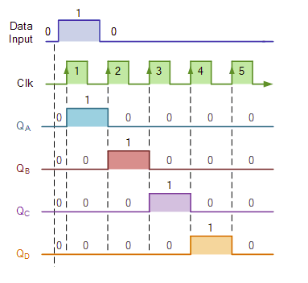
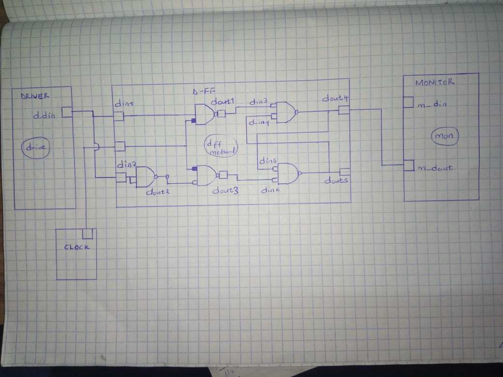
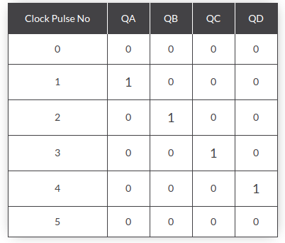
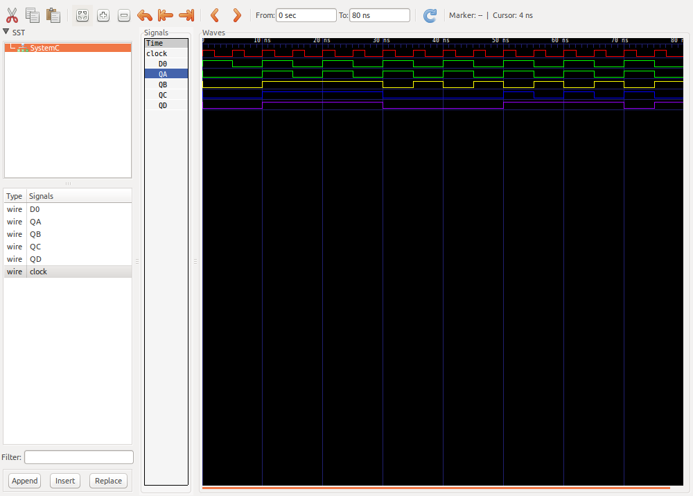

Here we model the 4 bit PISO shift register. For this type of register, the data is supplied in parallel, for example consider the 4-bit shift register shown in the circuit below.
This register can be used to store and shift a 4-bit word, with the write/shift (WS) control input controlling the mode of operation of the shift register. When the WS control line is low (Write Mode), data can be written and clocked in via D0 to D3. To shift the data out serially, the WS control line is brought HIGH (Shift mode), the register then shifts the data out on clock input.
The implementation is achieved by using the DFF modelled earlier. Four instances of the previous DFFs are created and more gates added according to the circuit below. 

### The circuit for the register
The circuit implementation of the D-flipflop is as shown below

  

### The timing diagram 
The timing diagram of the above register is as shown below

  

### The MOC 
The MOC of the lab is as shown below

  

### The Truth table
The truth table of the register above is as shown below

  

### The result 
The result of this lab is shown in image below

  

### conclusion
Conclusion:
The objective of this lab, to model a 4 bit PISO shift register using D-flipflops and other gates.

