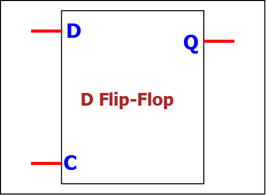
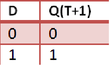
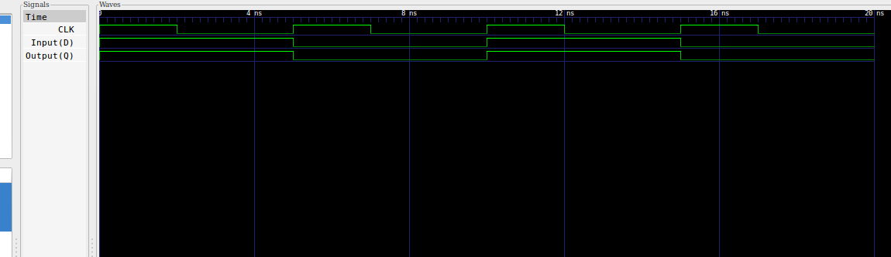
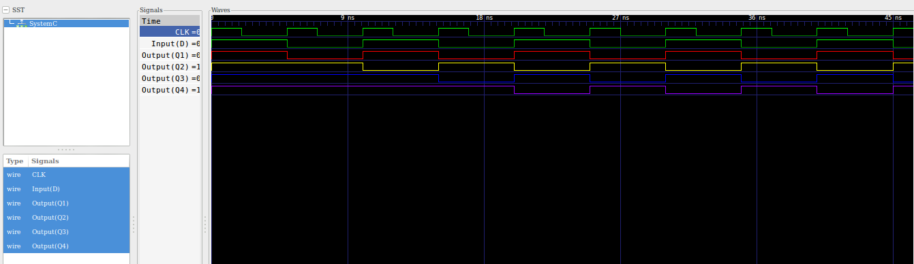

### The D Flip-flop

The D flip-flop is a Bi-stable latch that uses the clock signal as the control signal. 
The D flip-flop modelled here is sensitive to the positive/ rising edge of the clock.<b>
The input will be transmitted to the output of the flip-flop everytime the clock is at the rising edge. 

### D Flip-Flop

  

### Truth Table 

  

### Model of Computation

  

### Timing Diagram

  

### D Flip-flop in detail
Logic gates can be combined to make a D flip-flop. 
Combine four nand gates and a single not gate. 
The image below shows how this can be acheived. 

  

### Four bit shift register
Shift Registers can be used to transfer data or swith between serial and parallel data . 
With every clock cycle, the data that was at the input of the flip-flop is pushed to the next flip-flop's input, that is, the output of one flip-flop feeds the input of the following flip-flop. 
A single clock drives all of the flip-flops in order to synchronize them. 
Below is the depiction of the four bit register.

  

Below is the timing diagram of the 4 bit shift register. 

  

