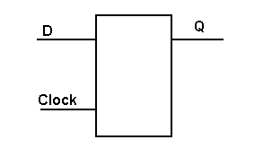
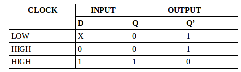
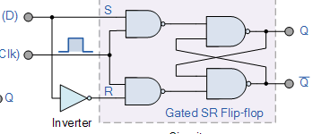
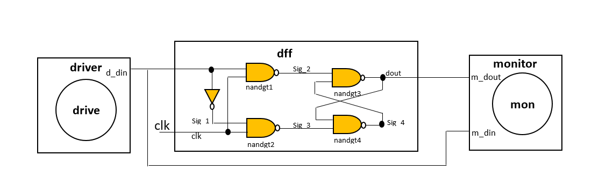
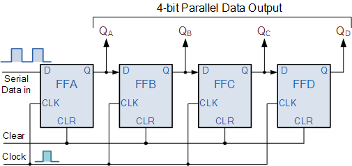
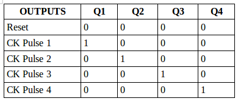
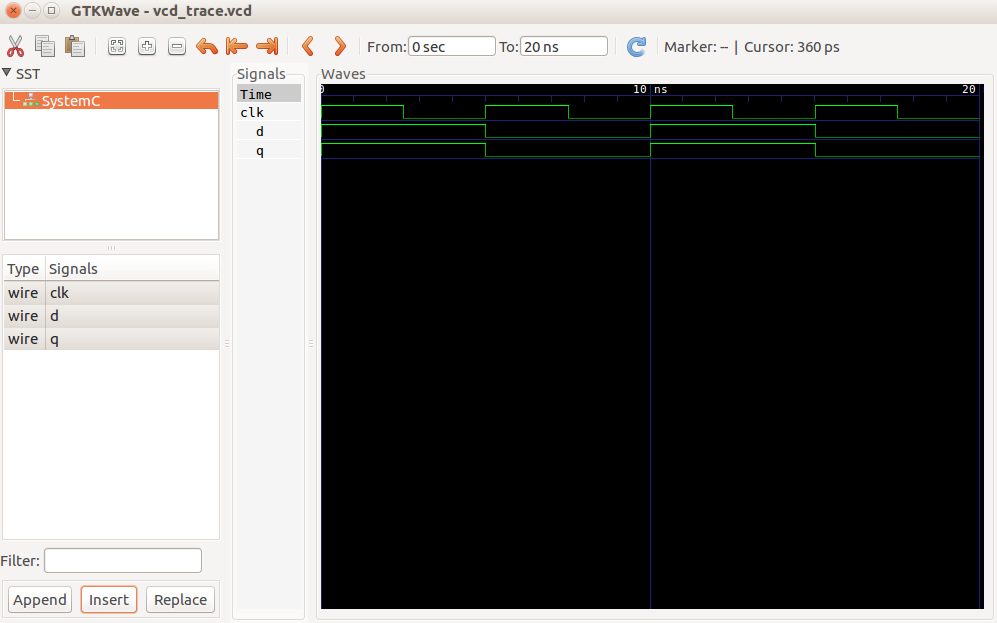

### THE D-FLIP-FLOP:

The D flip-flop tracks the input, making transitions with match those of the input D. The D stands for "data"; this flip-flop stores the value that is on the data line. It can be thought of as a basic memory cell. A D flip-flop can be made from a set/reset flip-flop by tying the set to the reset through an inverter. it captures the value of the D-input at a definite portion of the clock cycle (such as the rising edge of the clock).  That captured value becomes the Q output. At other times, the output Q does not change. 

  

### Truth Table:
Below is a D-Flipflop truth table:

  

### Circuit:

  

### Model of computation:
A Model of computation for the D_Flipflop is as shown below:

  

### THE 4-BIT SHIFT REGISTER:

The Shift Register is a type of sequential logic circuit that can be used for the storage or the transfer of binary data. It consists of a group of flip-flops arranged such that the output of one feeds the input of the next such that the binary numbers stored, shift from one flip-flop to the next controlled by a clock pulse. For a 4-bit shift register utilising the d-type flip-flops, the clock inputs of all the flip-flops connect to a common line, hence they receive clock inputs simultaneously. With a d-type flip-flop, the value at the input D transfers to the output Q on the rising edge of every clock pulse. Since they all receive the clock pulse simultaneously, they all do this operation together on the rising edge.

An implemantation of a 4-bit shift register is shown below

  

A truth table representing a 4-bit shift register is as shown below

  

### Results:
Shown below are the outputs, from the traced signals, of the D-Flipflop when the above Mod Of Computation of a D-Flipflop was implemented in systemc. 
Traced signals timing diagram:

  

Below is a timing diagram of a 4-bit shift register

  

### Conclusions:
Some of the applications of a D-Flipflop include; 

In sampling circiuts, edge triggered D flip flops are used to sample the data at particular time interval, at a sharp interval when the clock changes from low to high the input data will be delivered to the output and it remains the same until the next clock low to high. We can adjust the sampling intervals by changing the clock pulse widths.

A D-Flipflop is used as a buffer to store the intermediate data.
It is also used to introduce the delay in the circuits.

A D-Flipflop was successfuly implemented using four instances of a NAND gate and an instance of a NOT gate. 

Registers are used in digital electronic devices such as computers for:
Temporary data storage 
Data transfer 
Data manipulation 
As counters. 

One of the main application of a  Serial in Parallel Out(SIPO) shift register is to convert serial data into parallel data. Hence they are used in communication lines where demultiplexing of a data line into several parallel line is required.

