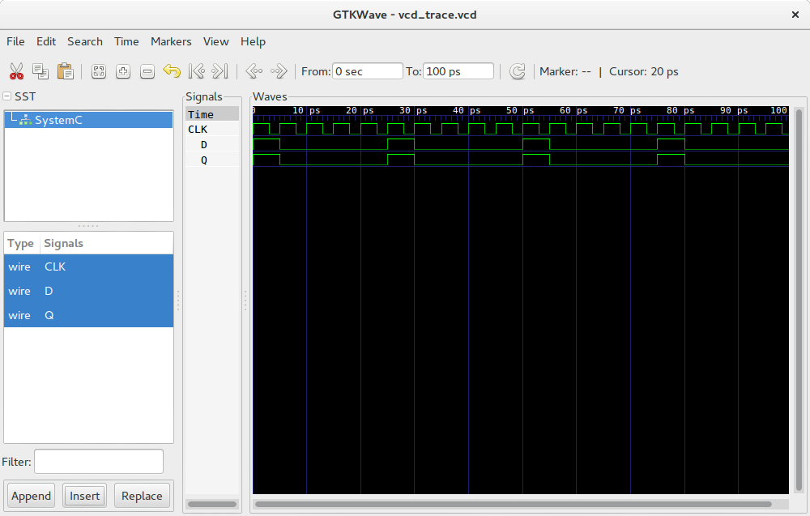
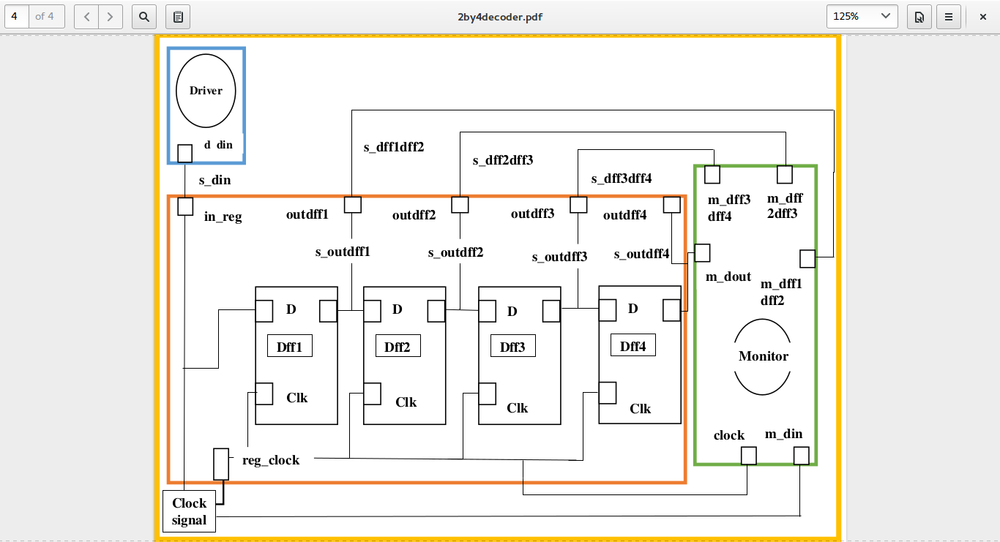
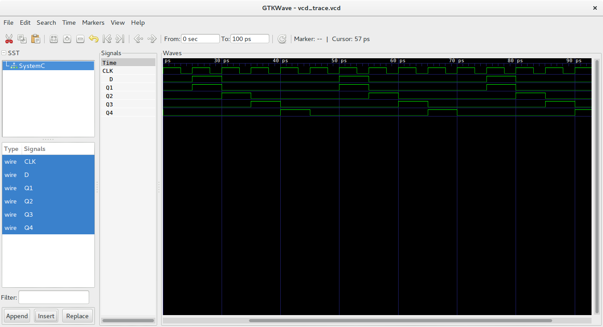

### The D Flip-flop
A flip-flop is a device that has two stable states and is used to store state information.
The D flip-flop captures input D and sends it to output Q at the positive or negative edge of the clock.
The D flip-flop modelled in here is triggered by the positive edge of the clock. 

### D Flip-Flop

  

### Truth Table 
The truth table of a d flip-flop is as follows 

  

### Model of Computation

  

### Timing Diagram

  

### Detailed D Flip-flop
The D Flip-flop is made of a combination of logic gates. One of the combinations is the use of four Nand Gates and a Not Gate. The connections of the gates is as shown in the image below. 

  

### Four bit shift register
A simple Shift Register can be made using only D-type flip-Flops, one flip-Flop for each data bit. The output from each flip-Flop is connected to the D input of the flip-flop at its right. Shift registers hold the data in their memory which is moved or “shifted” to their required positions on each clock pulse.
The number of latches in a bit shift register depend on the number of bits to be stored. 

The 4 bit shift register looks as shown below

  

Model of Computation used to develop the shift register:

  

The timming diagram of the 4 bit shift register is as follows

  

