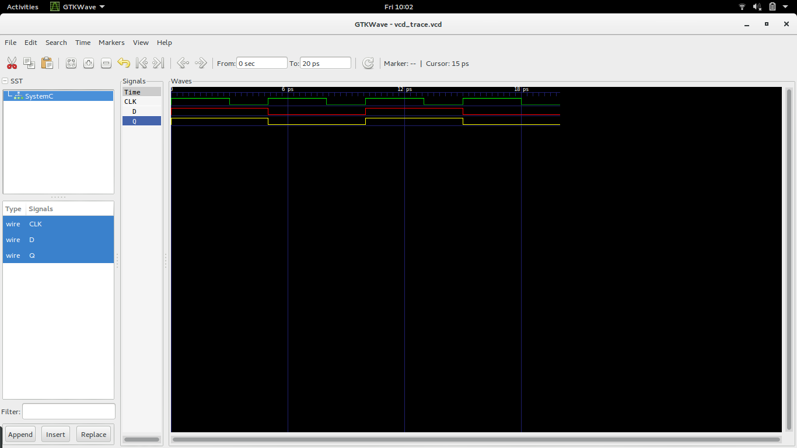

### The D Flip-flop
A flip-flop is a device that has two stable states and is used to store state information.
The D flip-flop captures input D and sends it to output Q at the positive or negative edge of the clock.
The D flip-flop modelled in here is triggered by the positive edge of the clock. 

### D Flip-Flop

  

### Truth Table 
The truth table of a d flip-flop is as follows 

  

### Timing Diagram

  

