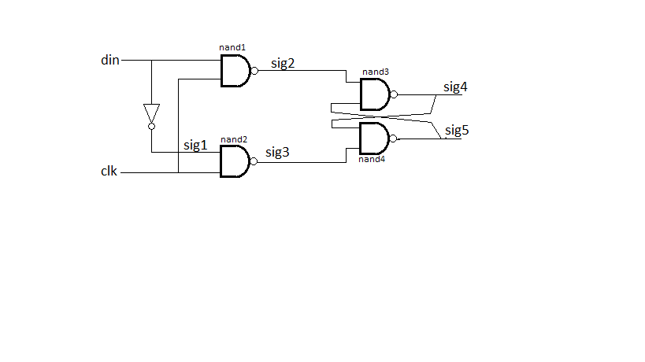
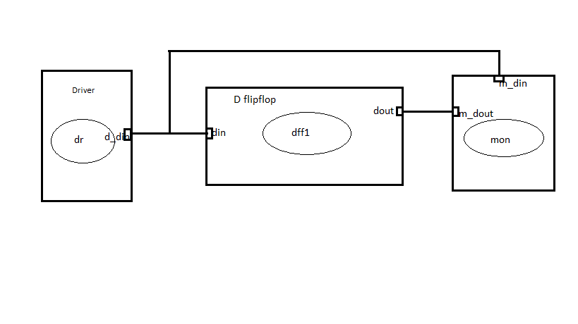

# Implementing a D-flipflop in systemc
A D-type flip-flop has two stable states and a delay in one clock cycle. They are used in many applications like in digital television.
It has two outputs where one is an inverse of the other and the input are either 0 or 1. This is either low or high voltage. The given clock synchronizes the circuit

# How it's made
The abstract implementation is made from a provided code base. What was added was the extra functionality for the design.
NAND gates were used where among the first sets was an inverter.
Signals were connected between all the four instances of NAND gates that were created. The output was routed to the monitor as well as the inputs in order to compare the two.
The flip-flop will store and output the logic value applied to its data terminal while the clock input is HIGH. Once the clock input goes LOW the “set” and “reset” inputs of the flip-flop are both held at logic level “1” so it will not change state.

### Project overview
## Appearence

<p align="left">
  
</p>

## Module of computation
<p align="left">
  
</p>


### Requirements
This project was made using the systemc c++ library. The library is required to implement the functionality of the code or even change it. 
Running "make" requires you to have the program installed.
Building the program also checks if the software, gtkwave is installed and if it's not, then it may be installed as it's needed to graphically view the outputs.

### Running the program
Clone the repository from github to your drive using or download the zip file and paste it in the desired drive.
Extract the contents of the zip folder to the drive then run the code: 
```sh
$ make all
```
NOTE: This must be done in the same drive.

### Cleaning up 

```sh
$ make clean
```
## NOTES:
1. The .cc files contain the implementation of the modules included.
2. The .h files contain the declaration of the modules.
3. The .h files must be included in other files where the respective classes are needed to be implemented.
4. This project requires the systemC library to create and upgrade.
5. The base code for the D-flipflop module was acquired from a different github repository: 

```sh
https://github.com/Muriukidavid/systemc-examples
```

### Conclusions
The desired output was visualized on the program, gtkwave. This is an indicator that the implementation of the D-flipflop indeed does work. 
