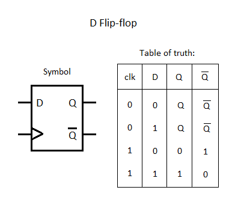
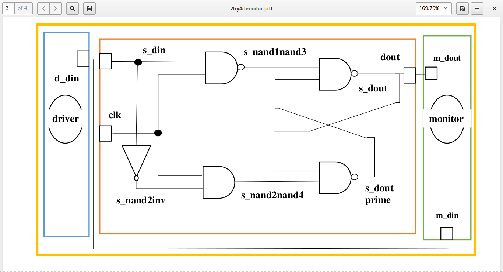
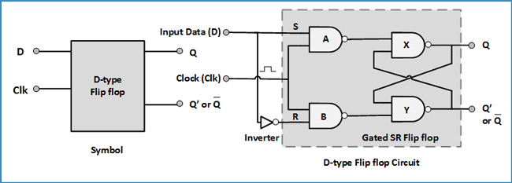
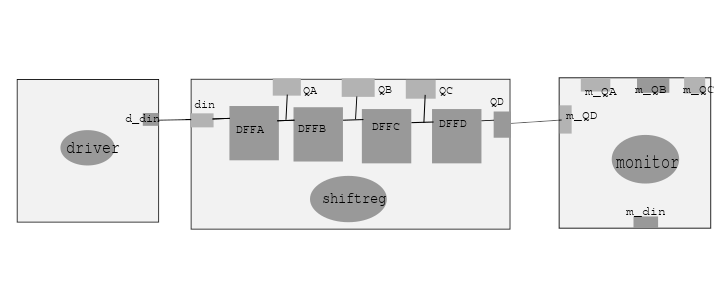

### The D Flip-flop
A flip flop is an electronic circuit with two stable states that can be used to store binary data. The stored data can be changed by applying varying inputs. Flip-flops and latches are fundamental building blocks of digital electronics systems used in computers, communications, and many other types of systems. Flip-flops and latches are used as data storage elements. It is the basic storage element in sequential logic.
The D flip-flop captures input D and sends it to output Q at the positive or negative edge of the clock.
The D flip-flop modelled in here is triggered by the positive edge of the clock. 

### D Flip-Flop

  

### Truth Table 
The truth table of a d flip-flop is as follows 

  

### Model of Computation

  

###Timing Diagram

  

### Detailed D Flip-flop
They are used for storage or movement of data.The D Flip Flop is by far the most important of the clocked flip-flops as it ensures that ensures that inputs S and R are never equal to one at the same time.
The D-type flip-flop is a modified Set-Reset flip-flop with the addition of an inverter to prevent the S and R inputs from being at the same logic level.
The D Flip-flop is made of a combination of logic gates. One of the combinations is the use of four Nand Gates and a Not Gate. The connections of the gates is as shown in the image below. 

  

### Four bit shift register
The Shift Register is another type of sequential logic circuit that can be used for the storage or the transfer of binary data.
A shift register basically consists of several single bit “D-Type Data Latches”, one for each data bit, either a logic “0” or a “1”, connected together in a serial type daisy-chain arrangement so that the output from one data latch becomes the input of the next latch and so on.
Data bits may be fed in or out of a shift register serially, that is one after the other from either the left or the right direction, or all together at the same time in a parallel configuration.
They are all driven by the same clock signal making them synchronous.
The number of latches in a bit shift register depend on the number of bits to be stored. 

The 4 bit shift register looks as shown below

  

