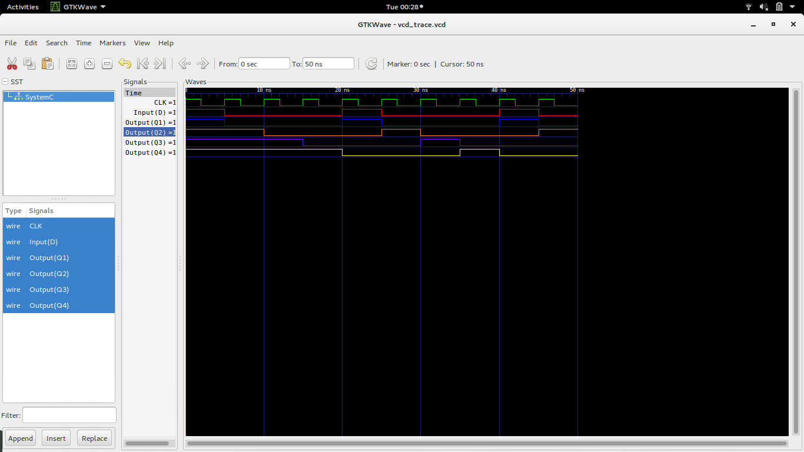

### The D Flip-flop

D flip-flop is a controlled Bi-stable latch where the clock signal is the control signal. 
They can either be positive edge triggered D flip flop or negative edge triggered D flip-flop. 
The clock has to be high for the inputs to get active. 
The D flip-flop modelled in here is triggered by the positive edge of the clock.It has input D and output Q. 

### D Flip-Flop

  

### Truth Table 
The truth table of a d flip-flop is as follows 

  

### Model of Computation

  

### Timing Diagram

  

### Detailed D Flip-flop
The D Flip-flop is made of a combination of logic gates. 
One of the combinations is the use of four Nand Gates and a Not Gate. 
Its connection is as shown. 

  

### Four bit shift register
Shift Registers are sequential logic circuits, capable of storage and transfer of data. 
They load the data present on their inputs and then moves or “shifts” it to its output once every clock cycle. 
It consists of several D Flip-flop,one for each data bit connected together in serial. 
The output of one latch becomes input of the next latch. 
They are all driven by the same clock signal making them synchronous. 
The 4 bit shift register is as shown:

  

The timming diagram of the 4 bit shift register 

  

###Conlusion
The 4-bit shift register was implemented successfully . 

