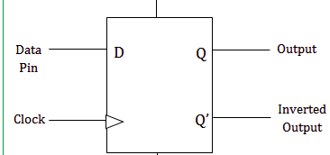

ABALLA SAMUEL OTIENO
I39/2498/2016
### THE D-FLIP-FLOP:

A D-Flipflop, also known as a "data" or "delay" flip-flop captures the value of the D-input at a definite portion of the clock cycle (such as the rising edge of the clock).  That captured value becomes the Q output. At other times, the output Q does not change.  The D flip-flop can be viewed as a memory cell, a zero-order hold, or a delay line. 

  

### Truth Table:
Below is a D-Flipflop truth table:

  

### Circuit:

  

### Model of computation:
A Model of computation for the D_Flipflop is as shown below:

  

### Results:
The above Mod Of Computation was implemented in systemc and the following output found from the traced signals. 
Traced signals timing diagram:

  

### Conclusions:
Applications of a D-Flipflop include; 

Edge triggered D flip flops are used in the sampling circuits to sample the date at particular time interval. i.e. at a sharp interval when the clock changes from low to high the input data will be delivered to the output and it remains the same until the next clock low to high. We can adjust the sampling intervals by changing the clock pulse widths.

It is used as a buffer to store the intermediate data

It is also used to introduce the delay in the circuits.

A D-Flipflop was thus implemented using four instances of a NAND gate and an instance of a NOT gate.
