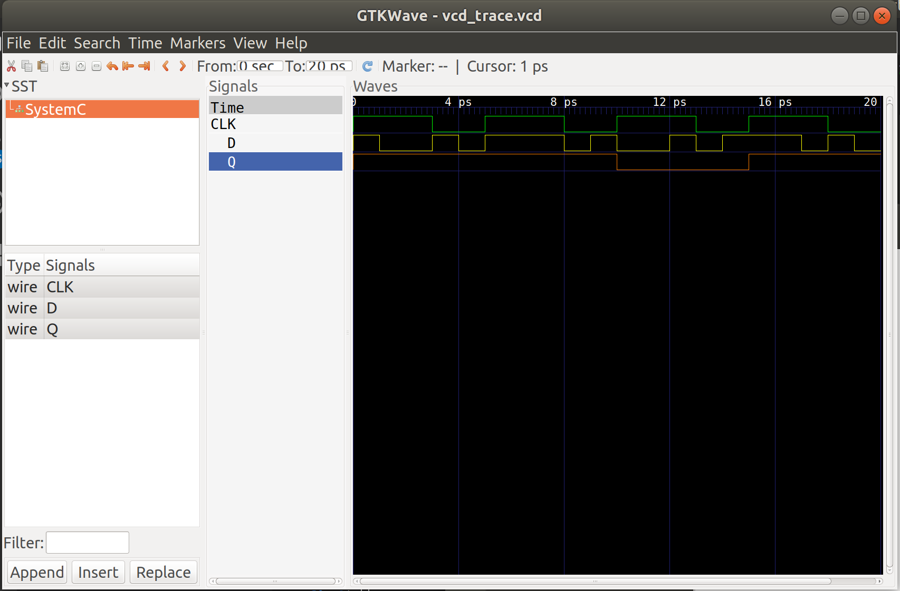
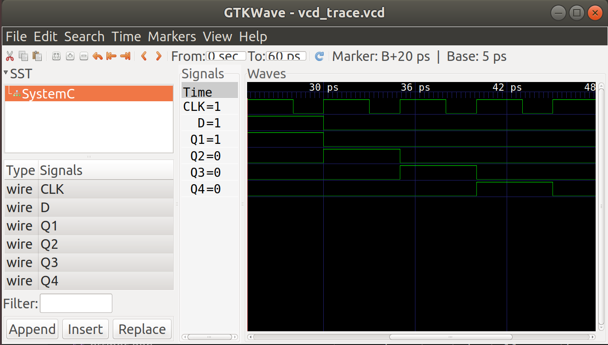

### The D Flip-flop
A flip-flop is a device that has two stable states and is used to store state information.Flip-flops are clocked circuits whose output may change on an active edge of the clock signal based on its input.Unlike latches, which are transparent and in which output can change when the gated signal is asserted upon the input change, flip-flops normally would not change the output upon input change even when the clock signal is asserted. Flip-flops are widely used in synchronous circuits.
The D flip-flop is a widely used type of flip-flop. It is also known as a data or delay flip-flop.A D flip-flop has a single data input. This type of flip-flop  is obtained from the SR flip-flop  by connecting the R input through an inverter, and the S input is connected directly to data input. The modified clocked SR flip-flop is known as D-flip-flop.
The D flip-flop captures input D and sends it to output Q at the positive or negative edge of the clock.At other times, the output Q does not change. The D flip-flop can be viewed as a memory cell or a delay line.
The D flip-flop modelled in here is triggered by the positive edge of the clock. 

### D Flip-Flop

  

### Truth Table 
The truth table of a d flip-flop is as follows 

  

### Model of Computation
Model of Computation used to develop the D flip-flop:

  

### Detailed D Flip-flop
The D Flip-flop is made of a combination of logic gates. One of the combinations is the use of four Nand Gates and a Not Gate. The connections of the gates is as shown in the image below. 

  

### Results

The above MOC was implemented in systemc (code in this folder) and the following output found from traced signals. 
Traced signals timing diagram:

  

### CONCLUSION
The outcome result were achieved as expected.

### Four bit shift register
A Register is a digital circuit that both stores data and moves data. The term shift
register is used to highlight that the register also moves data. Since a shift register
stores data it implemented using flip-flops. The flip-flop operation required is that of a
D-type flip flop.

The bit shift register moves data sequentially from intput to output once every clock cycle.
A bit shift register consists of D Flip-flop connected together. 
The output of one latch is connected to the input of the next latch.
They are all driven by the same clock signal making them synchronous.
They are used for storage or movement of data.
The operation of the Parallel-in Parallel-out shift register is straightforward. When a rising
clock edge is detected the outputs become equal to the inputs, i.e.
The number of latches in a bit shift register depend on the number of bits to be stored. 

The 4 bit shift register looks as shown below

  

### Results

The above MOC was implemented in systemc (code in this folder) and the following output found from traced signals. 
Traced signals timing diagram:

  

### CONCLUSION
The outcome result were achieved as expected.

