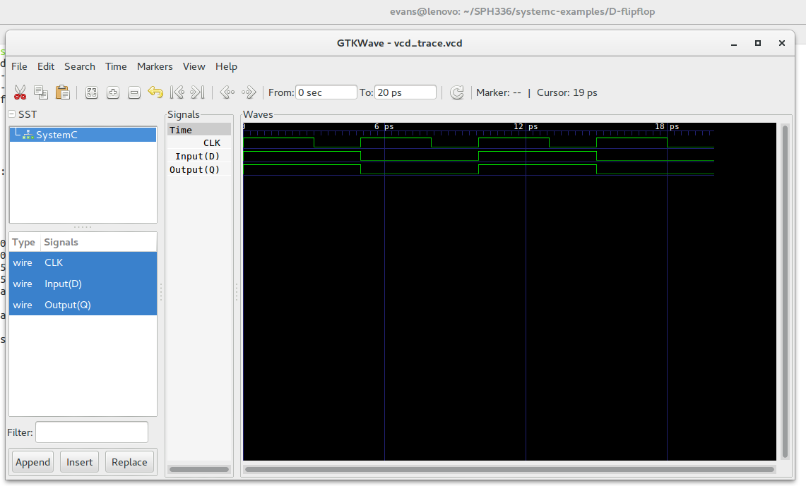

<h1>The D Flip-flop</h1>

A flip-flop is a device that has two stable states and is used to store state information. The D flip-flop captures input D and sends it to output Q at the positive or negative edge of the clock. The D flip-flop modelled in here is triggered by the positive edge of the clock.
D Flip-Flop

Truth Table

The truth table of a d flip-flop is as follows

  

Model of Computation

  

Timing Diagram

  

Detailed D Flip-flop

  

The D Flip-flop is made of a combination of logic gates. One of the combinations is the use of four Nand Gates and a Not Gate. The connections of the gates is as shown in the image above.

Four bit shift register

The bit shift register moves data sequentially from intput to output once every clock cycle. A bit shift register consists of D Flip-flop connected together. The output of one latch is connected to the input of the next latch. They are all driven by the same clock signal making them synchronous. They are used for storage or movement of data. The number of latches in a bit shift register depend on the number of bits to be stored.

The 4 bit shift register looks as shown below

  

The timming diagram of the 4 bit shift register is as follows

  

