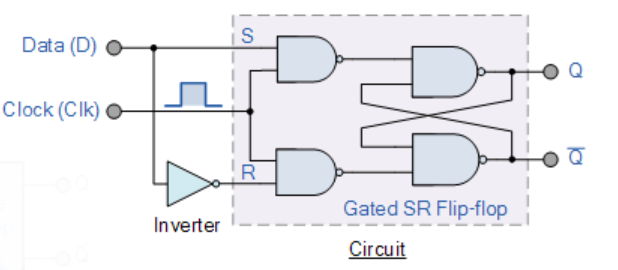

The D flip-flop tracks the input, making transitions which match those of the input D. The D stands for "data"; this flip-flop stores the value that is on the data line. It can be thought of  as a basic memory cell.

  

 A D flip-flop can be made from a set/reset flip-flop by tying the set to the reset through an inverter as shown below.A set/reset flip flop has 4 nand gates. Addition of the inverter prevents the  S and R inputs from being at the same logic level. the D input is only copied to the output when the clock is active

  

 the d flip flop will store output whatever logic level is applied to its data terminal so long as the clock is positive edged triggered as per the truth table below.

  

From the abstract d flip flop the Moc below was implemented in systemc whereby gate modules were created and interconnected.
 

<H1 align=center> Clocked D Flip-Flop</H1>

D flip-flop tries to follow the input D but cannot make the required transitions unless it is enabled by the clock. If the clock is low when a transition in D occurs, the tracking transiton in Q occurs at the next upward transition of the clock. 
 as shown in the following timming diagram which as the results obtainded from the Gtkwave.

  

   

