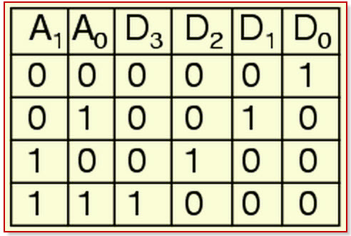

This is an extention of the generic decoder 2by4 but with instances of 1by2 decoder and 4 and gates.
It has an addition of the notgate.

### The Circuit:

  

###The truth table of the above circuit is as shown below:

  

The MOC of the above circuit is also shown below:

### computation model

  

### The Results:

  

