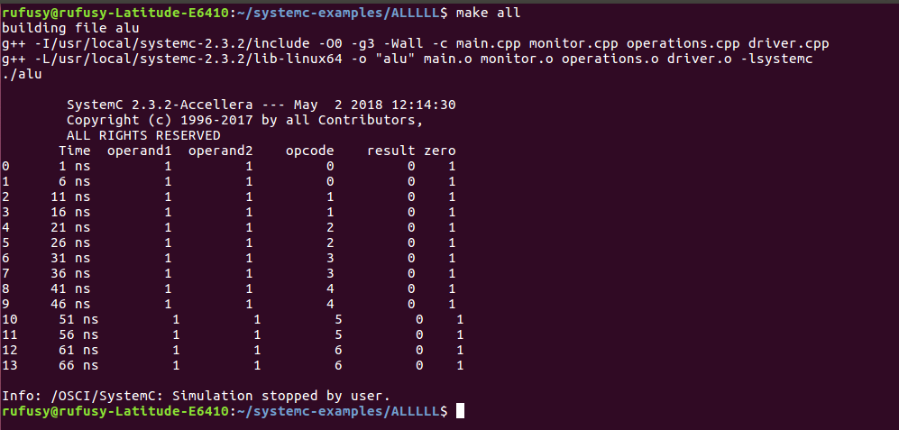

## Members (group 3)

* *i39/1526/2016:* implementation
* *i39/1518/2016:* implementation
* *i39/36218/2016:* implementation 
* *i39/36398/2016:* Theoretical background
* *i39/2510/2016:* Theoretical background

## Introduction

An arithemetic logic unit (ALU) is a combinational digital electronic circuit that perfoms arithemetic and bitwise operations on integer binary numbers. ALU is a fundamental building block of many types of computing circuits, including the CPU of computers, FPUs and GPU. A single CPU, FPU or GPU may contain multiple ALUs.
 
The inputs to an ALU are the data to be operated on, called operands, and a code indicating the operation to be performed. The output is the result of the perfommed operation. In many designs, the ALU has status inputs or outputs, or both, which convey information about a previous or the current operation, respectively, between the ALU and external status registers.
 
The symbolic represantation of the ALU is as shown below: 
 

  

 

## Signals

An ALU has a variety of input and output nets, which are the electrical conductors used to convey digital signals between the ALU and external circuitry. When an ALU is operating, external circuits apply signals to the ALU, in responce, the ALU produces and conveys signals to the external circuitry via its outputs.
 

## Data

A basic ALU has three parallel data buses consisting of two input operands (operand1 and operand2) and as a result output(result). Each data bus is a group of signals that conveys one binary integer number. Typically, the operand1, operand2 and result bus widths (the number of signals comprising each bus) are identical and match the native word size of the external circuitry.
 

## Opcode

The opcode input is a parallel bus that conveys to the ALU an operation selection code, which is an enumerated value that specifies the desired arithemetic or logic operation to be perfommed by the ALU. The opcode size (its bus width) determines the maximum number of different operations the ALU can perfom. For example, a three-bit opcode can specify up to eight different ALU operations.
 
The image below shows the operations corresponding to each opcode for this lab.
 

  

 

## Output

The status outputs are various individual signals that convey supplemental information about the result of the currentALU operation. General-purpose ALUs commonly have status signals such as:
 
* *carry-out*, which conveys the carry resulting from an addition operation, the borrow resulting from a subtraction operation, or the overflow bit resulting from a binary shift operation.
 
* *zero*, which indicates all bits of result are zero.
 
* *negative*, which indicates the result of an operation is negative.
 
* *overflow*, which indicates the result of an arithemetic operation has exceeded the numeric range of result.
  
* *parity*, which indicates whether an even or odd number of bits in result are logic one.
 
At the end of each ALU operation, the status output signals are usually stored in external registers to make them available for future ALU operations (e.g, to implement multiple-precission arithemetic) or for conditional branching. The collection of bit registers that store the outputs are often treated as a single, multi-bit register, which, is referred to as the "status register" or "condition code register". 
 

## Inputs

The status inputs allow additional information to be made available to the ALU when perfoming an operation. Typically, this is a single "carry-in" bit that is the stored "carry-out" from the previous ALU operation.
 

## Arithemetic operations
* *Add:* Operand1 and operand2 are summed and the sum appears at result and carry-out.
* *Subtract:* Operand2 is subtracted from operand1 (or vice versa) and the difference appears at result and carry-out. 
 appears at result and  carry-out (borrow out).

* *Increment:* Operand1 is increased by one and the output value appears at result.
* *Decrement:* Operand1 is decreased by one and the output value appears at result.
 

## Bitwise logical operations

* *AND:* the bitwise AND of operand1 and operand2 appears at result. 
* *NAND:* the bitwise NAND of operand1 and operand2 appears at result.
* *X-OR:* the bitwise XOR of operand1 and operand2 appears at result. 
* *OR:* the bitwise OR of operand1 and operand2 appears at result.
 

## Implementation

The MOC diagram:
 

  

 

Result: 
 

  

 

