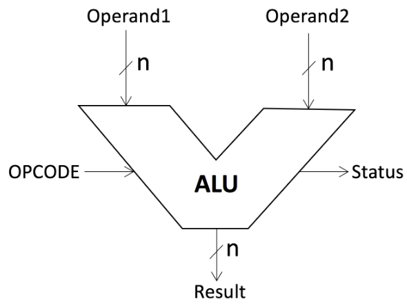
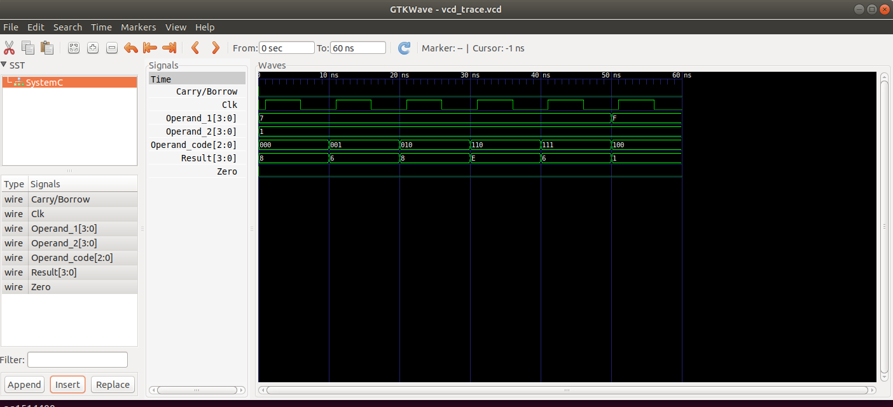

### CONTRIBUTORS
1. I39/2489/2016 	- Robert Kiptoo - Research
2. I39/41848/2011 	- Maurice Musyoka - Research
3. I39/2492/2016 	- Kevin Kibet - Coding
4. I39/1915/2016 	- Elkana Tuwei - Testing and Debugging
5. I39/2494/2016 	- Brian Shivalile - Report

To run, cd into the project folder and run the command:
```
make or make alu
```

### ALU(ARITHMETIC AND LOGIC UNIT)

An Arithmetic Logic Unit (ALU) is a combinational logic circuit that can perform different arithmetic and bitwise logical operations on integer binary numbers.

It takes two inputs, called operands, and a code, called OPCODE, which specifies the operation to be performed on the operands. It also has the result/output which is the result of the operation on the operands.

ALU may have Status signals on the output, which carry supplemental information about the results of the operation.e.g it can be a carry-out/borrow bit, zero bit, negative, and parity.
Operands and results generated are normally read or stored in registers.<br>

ALU can be depicted as shown:
<p align="left">
  
</p>

Operand1 and Operand2 are the inputs.

### OPERATIONS

ALUs perform Arithmetic(Addition, subtraction, multiplication and division) and logical(AND, OR, NOT, XOR, NOR, NAND) operations. These operations are identified by a unique code known as **OPCODE**.

Our implementation takes in two 4-bit numbers and carries out these operations on the input:
- [X] Sum of the two numbers.
- [X] Difference of the two numbers
- [X] Increment of the first operand (OP1) by 1.
- [X] Decrement of the first operand (OP1) by 1.
- [X] Bit-wise AND of the two numbers.
- [X] Bit-wise OR of the two numbers.
- [X] Bit-wise NAND of the two numbers.
- [X] Bit-wise XOR of the two numbers.

The result output of the ALU consisted of one 4-bit result (RESULT), a carry/borrow bit (CARRY) and a zero bit (ZERO).

The OPCODE Table of the operations are as shown:

| OP CODE    |  Operation    |
|------------|----------------|
| 000        | Addition        |
| 001        | Subtract        |
| 010        | Increment OP 1  |
| 011        | Decrement OP 1  |
| 100        | Bit-wise AND     |
| 101        | Bit-wise OR      |
| 110        | Bit-wise NAND     |
| 111        | Bit-wise XOR        |


### RESULTS

The ALU was implemented in systemc and the following output found from traced signals.

Traced signals timing diagram:
<p align="left">
  
<p>

### CONCLUSION
An arithmetic logic unit (ALU) is a digital circuit used to perform arithmetic and logic operations. It  the fundamental building block of the central processing unit (CPU).

The purpose of the ALU is to perform mathematical operations such as addition, subtraction, multiplication and division. Additionally, the ALU processes basic logical operations like AND/OR calculations. Also known as the arithmetic logic unit, it serves as the computational hub of the Central Processing Unit (CPU) for a computer system

