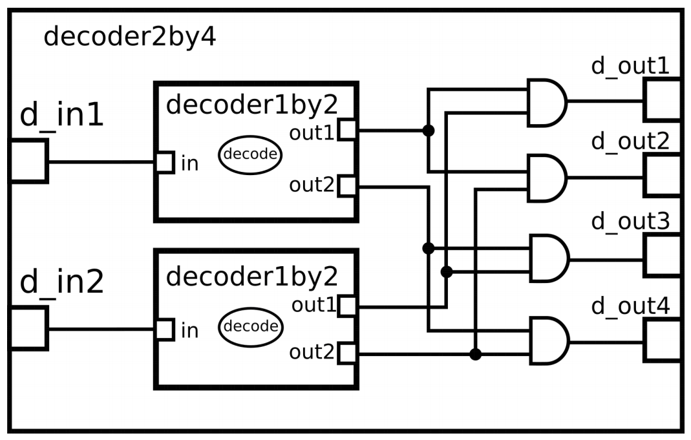
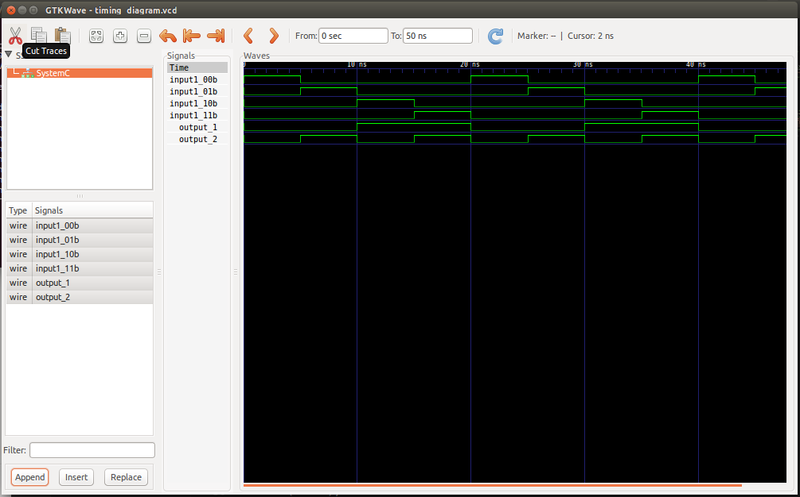

This is a 2-by-4 decoder, which is a makefile project and so no need for an IDE. 
When the terminal is located in the working directory, running the following command accomplishes all the work. 

    make decoder

A line decoder is a device that changes the input code into a set of signals. 
It takes n-digit binary number and decodes it into 2n data lines, the reverse of encoding.  
In the following truth table, only the output OUT1 is high when the inputs are low(0). The output Out2 is high when the input In_a is low(0) and In_b is high(1). The output Out3 is high when the input In_a is high and In_b is low. The output Out4 is high when the input In_a is high and In_b is high.It decodes a two digit binary number.
Only one signal is high(selected) when the right binary numbers are available on the inputs.  

### Truth table: 

  

### Circuit:

  

### Model of computation:

  

The internal models of the 2-by-4 decoder are modeled as follows:

  

### Results:
The above model of computation(MOC) was implemented using systemc (accompanying this document) and the following output found from traced signals. 
Traced signals timing diagram:

  

### Conclusion:
By running a single command,
  make decode
the files are compiled without errors and the required behaviour of the code exhibited.