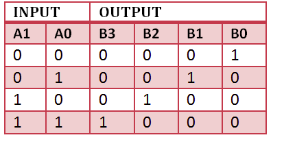
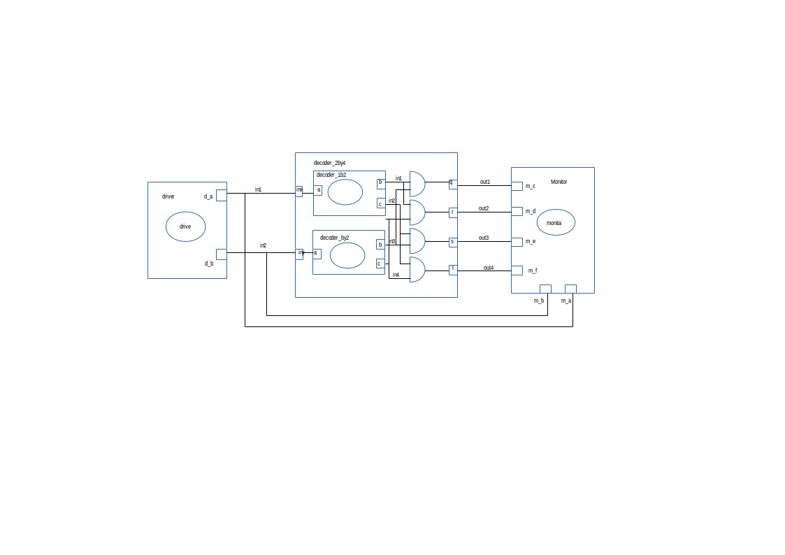

In this project a 2by4 decoder is made. It's a makefile project

    make all

A decoder_2by4 is a device that changes the input of two binary signals into a set of 4 binary outputs . 
The truth table shows that the output D0 is high when both inputs are zero,  output D1 is high when the inputs sre 01,output D2 is high when the inputs are 10,output D3 is high when the inputs are 11. It decodes a two digit binary number.  
Created a new git repository titled "dev".
In the dev repository, working files, decoder_2by4.cc, decoder_2by4.h, andgate.h, driver.h, NOTgate.h and monitor.h were created. 
Implementation for the different components was created and done in te header files  
The header files were then included in the main .cc file.

Its truth table: 

  

###Circuit:

  

Model of computation:

  

Results:
The above MOC was implemented in systemc (code in this folder) and the following output found from traced signals. 
Traced signals timing diagram:

  

Conclusion
From te timing diagram results, we see that the decoder worked as expected. It decoded a two digit binary input signal into a four digit one. 

