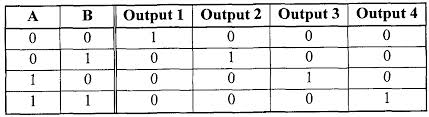
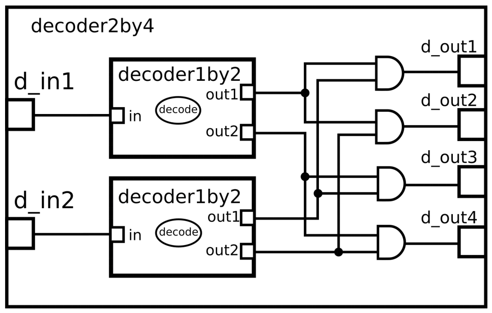
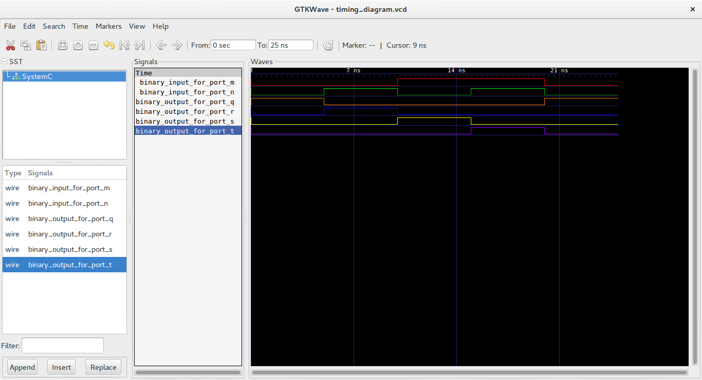

This is a 2-by-4 decoder which is a makefile project hence so no need for an IDE. 

Just cd into this folder and run the command 

    make 

A line decoder is a device that changes the input code into a set of signals. 
A decoder_2by4 is a device that changes the input of two binary signals into a set of 4 binary outputs. 
Only one signal is high  when the right set of binary inputs is available. 
This can be also be implemented  by using inverters inplace of 1by2 decoders and four ANDGATES. 
In earlier abstraction model of computation ,*andgate* module was created *andgate.h* and defined. 
Instances of 1by 2 decoders as well as Andgates were created in the 2by4.h and pin connections defined. 
These header files were then added in the *main.cc* file. 
Instance of an inverter was created *NOTgate.h*  in the 1by2 decoder file. 
This was then implemented in the decoder_1by4.h. 

The truth table shows that, only the output B1 is high when the input is 00,output B2 is high when the input is 01,output B3 is high when input is 10 and output B4 high when input is 11. it decodes a single digit binary number. 

Circuit of Inverter:

  

Its truth table: 

  

Its Model of computation:

  

### Results:

The above MOC was implemented in systemc (code in this folder) and the following output found from traced signals. 
Traced signals timing diagram:

  

###Discussion
The project was a new learning experience in use of systemc and the only challenge was that it required proper addressing pf ports and connections. 
###Conclusion
The results obtained from the timing diagram was as expected.The Decoder was fed with two inputs a1 and a2 and gave out four output signals b1,b2,b3,b4. 
