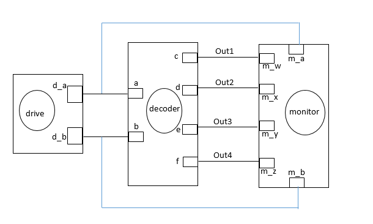

This is a 2-by-4 decoder example, which is a makefile project and so no need for an IDE. 
Just cd into this folder and run the command 

    make decoder

A line decoder is a device that changes the input code into a set of signals. 
It takes an n-digit binary number and decodes it into 2n data lines.
It does the reverse of encoding.  
In the following truth table, only the output D0 is high when the input is zero, and the output D1 is high when the input is 1. it decodes a single digit binary number.
Only one signal is high(selected) when the right binary number is available on the input.  
Its truth table: 

  

### Circuit:

  

### Model of computation:

  

### Results:
Below is the timing diagram

  

### Conclusion:
#### Challenges
* Eclipse IDE wasn't as friendly. It's 2018 :-)
#### Successes
* The results after implementation matched the truth table.

