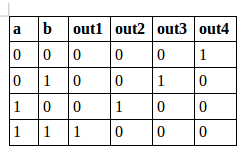

This is a 2-by-4 decoder example, which is a makefile project and so no need for an IDE.
Just cd into this folder and run the command

    make decoder

A line decoder is a device that changes the input code into a set of signals. 
It takes an n-digit binary number and decodes it into 2n data lines.
It does the reverse of encoding.  

Below is a 2by4 decoder truth table:

  

###Circuit:

  

###Model of computation:

  

A Model of computation of a 2by4 decoder using 4 AND gates and two 1by2 decoders:

  

###Results:
The above Mod Of Computation was implemented in systemc and the following output found from the traced signals. 
Traced signals timing diagram:

  

###Conclusion:
A 2by4 decoder was implemented using two instances of a 1by2 decoder and 4 AND gates.
