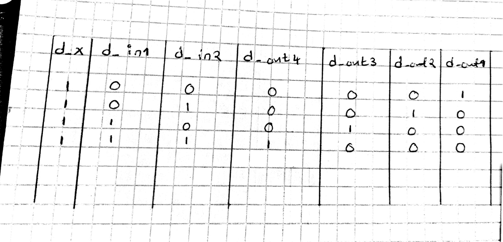
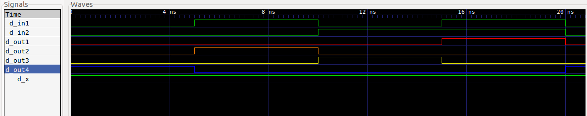

A 2 to 4 line decoder is a 4 output logic circuit that takes 2 inputs. At any point in time, according to the combination of the input signals, there can only be 1 output signal that is HIGH. 

This is reimplementation of the 2 to 4 line decoder with 2 more submodules. Therefore 2 new classes anding_gate and inverter are introduced to model the above functionality.
The 1 to 2 line decoder is implemented using 2 NOT gates and 2 AND gates as shown in the moc image below. The 1 binary input is fed into the port x1. The default binary input port is held high at all times and according to the binary input value fed into port x1, the truth table shown below is generated.
For simplicity, the default binary input is labelled as d_x in the truth table.

 
Circuit:
### Circuit:

  

Truth table:

  

The MOC of the reimplemented 1 t0 2 line decoder module is as shown below

### Model of computation:

  

### Results:
The above MOC was implemented in systemc (code in this folder) and the following output found from traced signals. 
Traced signals timing diagram:

  

### Conslusion:
Conclusion:
The 2 to 4 line decoder was implemented with lesser abstraction. The moc of the 1 to 2 line decoder may differ with one proposed in class, where only one inverter is used. However, the result obtained is correct.
