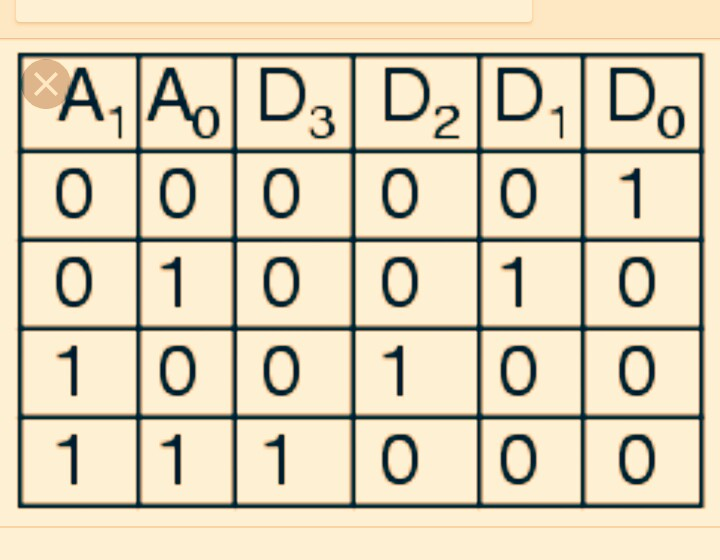
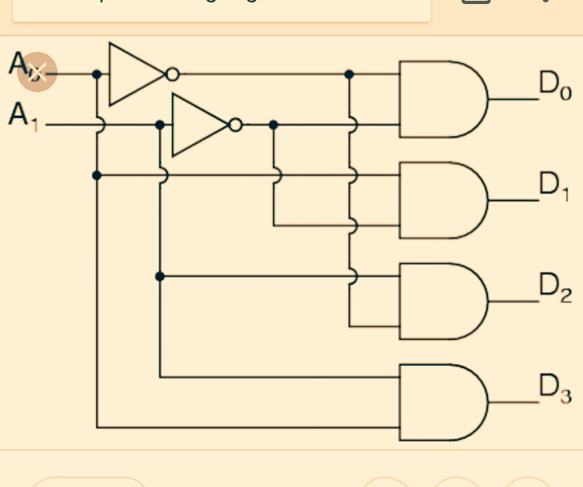
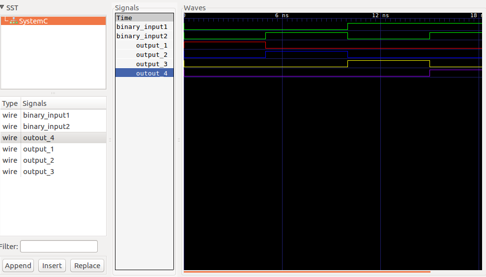

This is a 2-by-4 decoder with implementation of and logical gates. Its a makefile project and so no need for an IDE. 
Just cd into this folder and run the command 

    make 

A line decoder is a device that changes the input code into a set of signals. 
It takes an n-digit binary number and decodes it into 2n data lines.
It does the reverse of encoding.  

 There are 4 AND gates.A new module is created called and_gate and included in the file .cpp with the main function. Two instances of the module are created in the main function.

In the following truth table, only the output D0 is high when the both inputs zero, the output D1 is high when the the first input is zero and the second input is 1, the output D2 is high when input A0 is 1 and A1 is one and the output D3  is high when both inputs are high. it decodes a two digit binary number.
Only one signal is high(selected) when the right binary number is available on the input.  
Its truth table: 

  

###Circuit:

  

Model of computation:

  

Results:
The above MOC was implemented in systemc (code in this folder) and the following output found from traced signals. 
Traced signals timing diagram:

  

