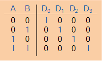
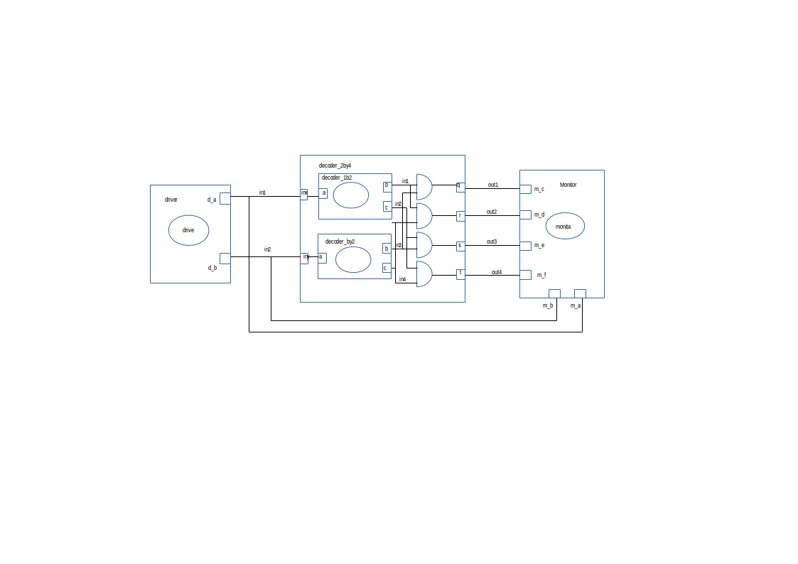

This is a 2-by-4 decoder example, implementation of logical and gates, which is a makefile project and so no need for an IDE. 
Just cd into this folder and run the command 

    make all

A line decoder is a device that changes the input code into a set of signals. 
It takes an n-digit binary number and decodes it into 2n data lines.
It does the reverse of encoding.  
Four and gates were included together with 2, 1by2 decoders.In the following truth table, the output D0 is high when both inputs are zero,  output D1 is high when the inputs sre 01,output D2 is high when the inputs are 10,output D3 is high when the inputs are 11. It decodes a two digit binary number.  
Its truth table: 

  

###Circuit:

  

Model of computation:

  

Results:
The above MOC was implemented in systemc (code in this folder) and the following output found from traced signals. 
Traced signals timing diagram:

  

