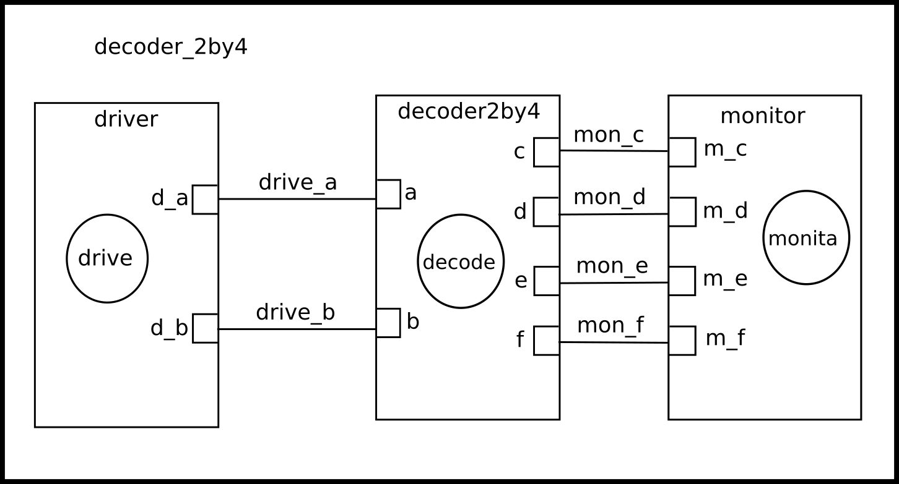
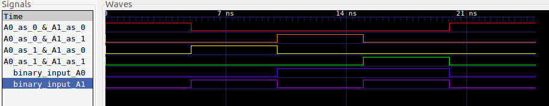

A 2 to 4 line decoder is a 4 output logic circuit that takes 2 inputs. At any point in time, according to the combination of the input signals, there can only be 1 output signal that is HIGH. 

As a decoder, The circuit is shown below:
 
### Circuit:

  

The truth table of the above circuit is as shown below:

  

The MOC of the above circuit is also shown below:

### Model of computation:

  

### Results:
The above MOC was implemented in systemc (code in this folder) and the following output found from traced signals. 
Traced signals timing diagram:

  

