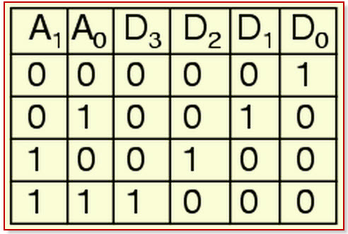
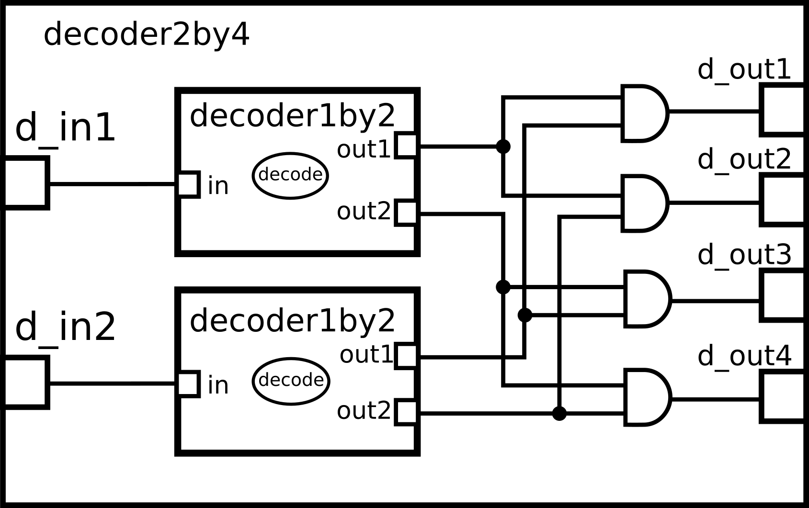
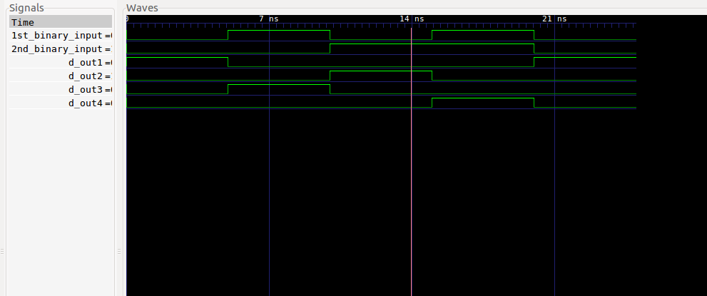

A 2 by 4  decoder is a four-output logic circuit taking  2 inputs. At any instance of time, according to the combination of the input signals, there can only be 1 output signal that is HIGH. 

This is reimplementation of the 2 to 4 line decoder with 1 more submodule. The level of abstraction has dropped to model the behaviour of the ANDing function perfommed on the output signals of the 1 to 2 line decoders.
Therefore a new class anding_gate is introduced to model the above functionality.
 
### Circuit:

  

The truth table of the above circuit is as shown below:

  

The MOC of the above circuit is also shown below:

### Model of computation:

  

### Results:

The above MOC was implemented in systemc (code in this folder) and the following output found from traced signals. 
Traced signals timing diagram:

  

