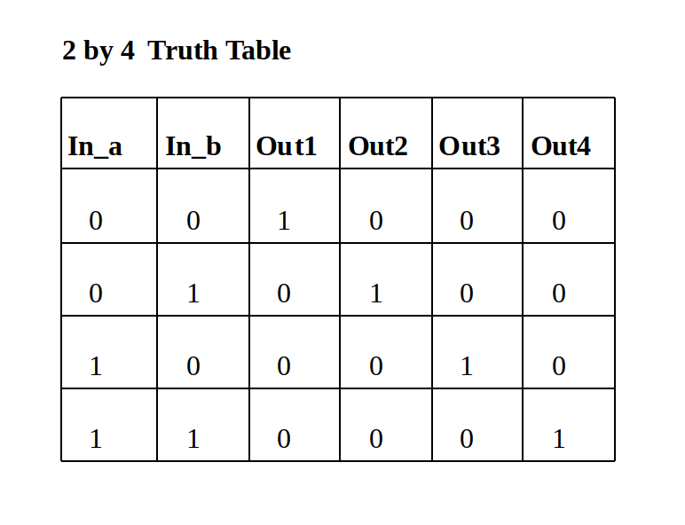
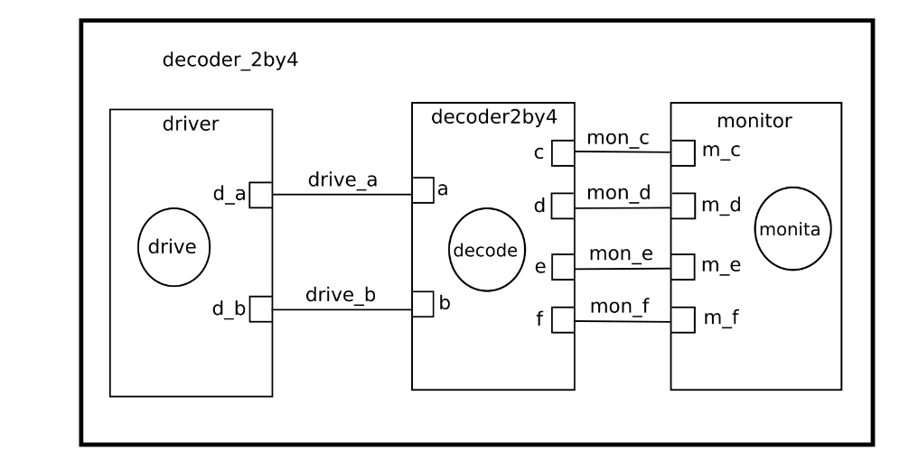
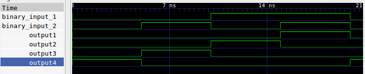

This is a 2-by-4 decoder example, which is a makefile project and so no need for an IDE. 
Just cd into this folder and run the command 

    make decoder

A line decoder is a device that changes the input code into a set of signals. 
It takes an n-digit binary number and decodes it into 2n data lines.
It does the reverse of encoding.  
In the following is a 2by4 decoder truth table.  
Its truth table: 

  

###Circuit:

  

Model of computation:

  

Results:
The above MOC was implemented in systemc (code in this folder) and the following output found from traced signals. 
Traced signals timing diagram:

  

RESULTS:
 The above MOC was implemented in systemc (code in this folder) and the following output found from traced signals. 
 Traced signals timing diagram:
