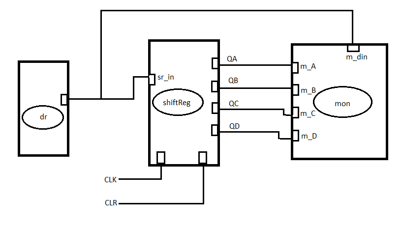

# The Shift Register

A shift Register (4-bit in this case) is made of 4 D-type flipflops that are connected. 
Implemented is a Serial Input Parallel Output (SIPO) shift register. Its input is fed in serially while the 
output can is given in a parallel configuration.
A flip-flop is a circuit that has two stable states and is 
used to store state information. The circuit changes state by means of signals applied to one or more control 
inputs and usually has one or two outputs. It is a basic storage element. 

# How it works

- A 4-bit shift register 
is constructed from  four D flip-flops. The data present on its inputs is loaded and then “shifted” to its output
 once every clock cycle, thus getting its name from this shifting. one D flipflop is used for each data bit and 
they're all connected together in a serial arrangement. Here, the output from one data latch becomes the input 
of the next latch.  All the flip-flops share the same clock signal.

### Link
* [Additional information](https://en.wikipedia.org/wiki/Shift_register)

## Appearence

  

## Module of Computation

  

### Implementation in SystemC

New files are created for the different modules that will be dequired. The files containing the definitions of 
the modules have the suffix .h and they include dff.h, NAND.h, driver.h and monitor.h. For the file named dff.h, 
additional modules are the NAND gates and the NOT gate. These are implemented inside the dff.h and the respective 
connections are made inside it as well. The main.cc file contains the implementation of the shift register when 
it's connected to all other modules such as the driver that generates the signal and the monitor that acts as the 
testbench. the file shiftR.h implements the shift register borrowing instances of the D flip-flop module from the 
dff.h file.To get the readings, the output is generated in the program called gtkwave.